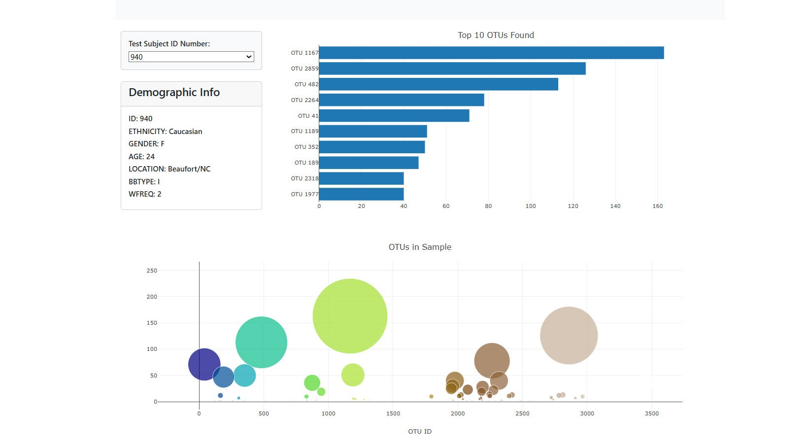

# Module 14: Belly Button Biodiversity Dashboard  
**By Anqa Javed**

This project is an interactive data visualization dashboard that displays microbiological data collected from human belly buttons. The application allows users to select a test subject ID and view their bacterial data through dynamic charts and demographic information.

---

## Deployed Application

[Click here to view the live dashboard](https://anqajaved.github.io/belly-button-challenge/)

---

## Screenshot

---

## Description

This dashboard is built using JavaScript, D3.js, and Plotly.js. It reads data from a JSON file and displays:

- A horizontal bar chart showing the top 10 bacterial cultures found
- A bubble chart displaying all bacterial cultures per sample
- A demographic information panel that updates with the selected sample
- A dropdown menu that dynamically updates all charts and information

The dashboard runs entirely in the browser and does not require any backend server or installation.

---

## Technologies Used

- JavaScript (ES6)
- D3.js
- Plotly.js
- HTML5
- Git & GitHub
- GitHub Pages for deployment

---

## File Structure

belly-button-challenge/ ├── index.html ├── README.md ├── samples.json ├── image/ │ └── final-chart.jpg ├── static/ │ └── js/ │ └── app.js

---

## How It Works

- `index.html` contains the layout and connects to JavaScript libraries and files.
- `app.js` contains all the logic for loading data, building charts, and handling user interactions.
- Data is loaded from a hosted JSON file using D3.
- When a new sample is selected from the dropdown, the charts and demographic panel update automatically.

---

## Data Source

Data is retrieved from the following JSON file:  
https://static.bc-edx.com/data/dl-1-2/m14/lms/starter/samples.json

The file contains:
- `names`: a list of all sample IDs
- `metadata`: demographic details for each subject
- `samples`: OTU data for each subject
